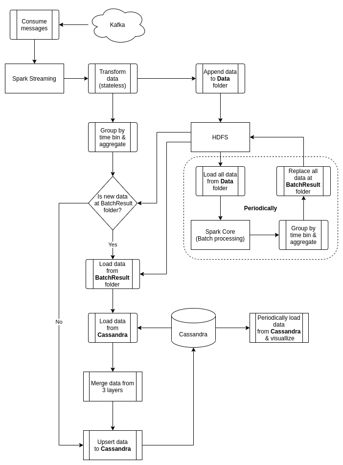

# An Implementation Of The Optimised Lambda Architecture

Inspired by this awesome [paper](https://cds.cern.ch/record/2751541/files/08336995.pdf) of Uthayanath Suthakar, Luca Magnoni, David Ryan Smith and Akram Khan.

Source code used in this project is forked from [https://github.com/apssouza22/lambda-arch](https://github.com/apssouza22/lambda-arch), a project of [apssouza22](https://github.com/apssouza22) that implements the old lambda architecture.

## Architecture

The abstract architecture with used technologies is shown as below:

The architecture includes:

- **Kafka**: The message broker, where services or devices data are sent to. Those data will then be pushed to **HDFS** for later batch processing, sent to **Streaming Layer** for immediate processing and result.

- **HDFS**: Distributed, fault tolerant file system. Kafka raw messages (raw data) & batch processing result are sent to here. This technology is chosen because it fits perfectly with Apache Spark.

- **Batch Layer**: Apache Spark Core. This layer is scheduled to load all raw data from HDFS, dedupes and processes them periodically. The result will be sent to a known folder on HDFS and will replace all the old data in that folder. These data will then be used to correct the result produced by **Streaming Layer**.

- **Streaming Layer**: Apache Spark Streaming. Raw data from Kafka will be sent to this layer as a continuous stream and will be processed as minibatches. After process a minibatch, the layer will check if there are new data at the known folder in HDFS. If there are, the merging process will happen, that merges result data from Batch Layer, Streaming Layer and update the Serving Layer. This will ensure that the data in Serving Layer is eventually consistent.

- **Serving Layer**: ClickHouse. Result data are stored in this layer. There will be some pre-computed view (that are called Materialized View in ClickHouse), that aggregates data when they are inserted to ClickHouse. These view will enhance the performance of queries. The dashboard application will get data from these view to visualize statistics. Admin can use ClickHouse client to query stats from ClickHouse directly.

### Flowchart

Overall workflow of the system is described as follow:

### ClickHouse Model Design

## Performance Testing

### Test environment

### Test result
