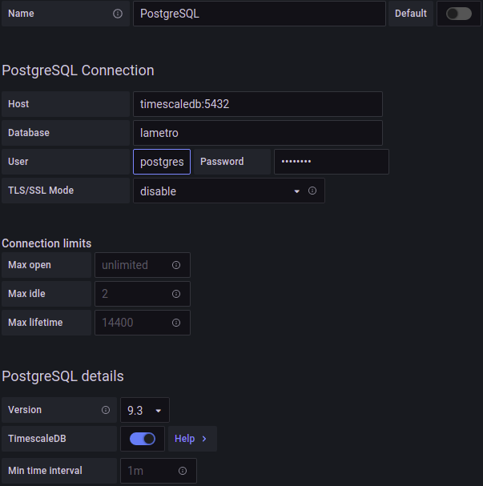
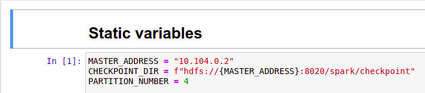

# Hướng dẫn cụ thể triển khai hệ thống

Hệ thống sử dụng trong luận văn được cài đặt trên ba máy chủ ảo của Microsoft Azure, trong đó một máy chịu trách nhiệm chạy các tác vụ điều khiển và cơ sở dữ liệu, hai máy còn lại chạy tiến trình Spark Executor và HDFS DataNode. Chi tiết các tác vụ được trình bày trong hình sau:


## Triển khai các tác vụ

### Thiết lập các thông số cần thiết

Ở tệp tin [ssh/constants.cfg](./ssh/constants.cfg), điều chỉnh các thông số cho phù hợp với môi trường triển khai hệ thống. Trong đó:

- `MASTER_ADDRESS`: Địa chỉ public của máy master.
- `MASTER_INTERNAL_ADDRESS`: Địa chỉ nội bộ của máy master. Các máy worker cần phân giải được địa chỉ này và truy cập được tất cả các port sử dụng địa chỉ này.
- `MASTER_HOSTNAME`: Tên máy master.
- `WORKER_NUM`: Số lượng máy worker.
- `WORKER_ADDRESS_<i>`: Địa chỉ máy worker thứ `i`.
- `WORKER_INTERNAL_ADDRESS_<i>`: Địa chỉ nội bộ của máy worker thứ `i`. Máy master cần phân giải được địa chỉ này và truy cập được tất cả các port sử dụng địa chỉ này.
- `WORKER_HOSTNAME_<i>`: Tên máy worker thứ `i`.
- `SSH_USERNAME`: Tên tài khoản dùng để truy cập các máy chủ.
- `SSH_KEY_PATH`: Đường dẫn đến tập tin khoá bảo mật (private key) để truy cập đến các máy chủ. Trên các máy chủ cần có các tệp khóa công khai (public key) để xác nhận sự truy cập.

Xem thêm cách tạo khóa và truy cập máy chủ từ xa tại: [Hướng dẫn cách truy cập các máy chủ tử xa sử dụng ssh và khóa](https://www.digitalocean.com/community/tutorials/how-to-configure-ssh-key-based-authentication-on-a-linux-server).

Cuối cùng, copy tập tin [ssh/constants.cfg](./ssh/constants.cfg) lên các máy chủ:
```sh
./ssh/copy_to_all.sh ssh/constants.cfg .
```

### Cài đặt các công cụ cần thiết

#### Java
Các máy chủ cần có Java với phiên bản từ `11.0.11` trở lên.

```sh
./ssh/copy_to_all.sh libs/jdk-11.0.11_linux-x64_bin.tar.gz libs/
./ssh/run_command_on_all.sh "
    cd libs && \
    tar -xf jdk-11.0.11_linux-x64_bin.tar.gz && \
    rm jdk-11.0.11_linux-x64_bin.tar.gz
"
```

#### Python 3 và pip3
Máy chủ master cần có Python 3 với phiên bản từ `3.6.9` trở lên. Chi tiết cài đặt có thể xem ở đầy: [Hướng dẫn cài đặt Python 3 và pip3 trên Ubuntu Linux](https://vinasupport.com/huong-dan-cai-dat-python-3-va-pip-3-tren-ubuntu-linux/)

#### Docker 
Máy master sử dụng [Docker](https://www.docker.com/) để chạy các tác vụ cơ sở dữ liệu và Grafana.

- Cài đặt `docker` cho Ubunbu: [Hướng dẫn cài đặt Docker Engine trên Ubuntu](https://docs.docker.com/engine/install/ubuntu/).
- Thiết lập để việc sử dụng `docker` không cần phải có lệnh `sudo`: [Quản lý Docker như một người dùng không phải root](https://docs.docker.com/engine/install/linux-postinstall/#manage-docker-as-a-non-root-user).
- Cài đặt `docker-compose`: [Hướng dẫn cài đặt Docker Compose](https://docs.docker.com/compose/install/).

### Triển khai cụm Spark Standalone 

Cụm Spark Standalone bao gồm một Spark Master chạy ở máy master, và một Spark Executor chạy ở mỗi máy worker.

- Chạy Spark Master:
```sh
./ssh/copy_to_master.sh scripts/start_spark_master.sh .
./ssh/run_command_on_master.sh ./start_spark_master.sh
```

- Chạy các Spark Worker:
```sh
./ssh/copy_to_workers.sh scripts/start_spark_worker.sh .
./ssh/run_command_on_workers.sh ./start_spark_worker.sh
```

### Triển khai Jupyter Notebook

Luận văn sử dụng Jupyter Notebook để làm công cụ chỉnh sửa mã nguồn.

- Cài đặt các thư viện cần thiết:
```sh
./ssh/run_command_on_master.sh "pip3 install jupyter"
```

- Chạy Jupyter Notebook:
```sh
./ssh/copy_to_master.sh scripts/start_jupyter_notebook.sh .
./ssh/run_command_on_master.sh ./start_jupyter_notebook.sh
```

- Nếu máy master không có public IP, cần phải chạy lệnh:
```sh
./ssh/forward_master_port_to_local.sh 8888
```

- Nhấn vào đường dẫn hiện lên để truy cập Notebook. 

---
**NOTE** Đường dẫn để truy cập Notebook cần phải kèm theo token. Ví dụ: `http://localhost:8888?token=<token>`

---

### Triển khai hệ thống quản lý tập tin phân tán HDFS
HDFS gồm một tác vụ NameNode trên máy master và một tác vụ DataNode trên mỗi máy worker.

- Chạy NameNode:
```
./ssh/copy_to_master.sh scripts/start_namenode.sh .
./ssh/run_command_on_master.sh ./start_namenode.sh -format
```

- Chạy DataNode:
```
./ssh/copy_to_workers.sh scripts/start_datanode.sh .
./ssh/run_command_on_workers.sh ./start_datanode.sh -format
```

- Dùng port-forwarding để điều hướng các yêu cầu đến master:
```sh
./ssh/forward_master_port_to_local.sh 9870
```
Sau đó truy cập [http://localhost:9870](http://localhost:9870) để vào trang quản lý của HDFS.

### Triển khai Apache Kafka
Hệ thống sử dụng Apache Kafka như một trung gian truyền dữ liệu.

```sh
./ssh/copy_to_master.sh scripts/start_kafka.sh .
./ssh/run_command_on_master.sh ./start_kafka.sh
```

#### Chạy crawler
Hệ thống sử dụng NodeJS để viết một chương trình liên tục nhận dữ liệu từ trang [http://api.metro.net/agencies/lametro/vehicles/](http://api.metro.net/agencies/lametro/vehicles/), sau đó gửi vào trong Kafka.

```sh
./ssh/copy_to_master.sh source/crawler .
./ssh/copy_to_master.sh scripts/start_crawler.sh .
./ssh/run_command_on_master.sh ./start_crawler.sh
```

### Cơ sở dữ liệu
Hệ thống sử dụng TimescaleDB và Redis chạy trên nền Docker để làm cơ sở dữ liệu phục vụ truy vấn.

```sh
./ssh/copy_to_master.sh docker/databases .
./ssh/run_command_on_master.sh ./databases/start.sh
```

### Grafana
Hệ thống sử dụng Grafana để theo dõi trạng thái hoạt động của hệ thống, độ trễ, ...

#### Triển khai Grafana

- Chạy Grafana
```sh
./ssh/copy_to_master.sh docker/grafana .
./ssh/run_command_on_master.sh ./grafana/start.sh
```

- Sử dụng port-forwarding để chuyển hướng các yêu cầu đến port 3000 ở máy local đến máy master.
```sh
./ssh/forward_master_port_to_local.sh 3000
```
Giữ cửa sổ lệnh này mở để truy cập vào Grafana ở local.

#### Thiết lập Grafana

Truy cập [http://localhost:3000](http://localhost:3000), đăng nhập bằng tên tài khoản và mật khẩu `admin`.

##### Tạo nguồn dữ liệu

- Ở thanh công cụ bên trái màn hình, chọn biểu tượng bánh răng, sau đó chọn `Data sources`.<br>


- Chọn `Add data source`.<br>


- Điền thông tin như hình với mục `password` là `8zr7E3SV` (được thiết lập trong [docker/databases/docker-compose.yml](docker/databases/docker-compose.yml)), sau đó chọn `Save & Test`.<br>


##### Tạo trang quản lý:

- Ở thanh công cụ bên trái màn hình, chọn biểu tượng dấu cộng, sau đó chọn `Import`.<br>


- Chọn `Upload JSON file` và chọn tập tin nằm ở [docker/grafana/dashboard.json](docker/grafana/dashboard.json). Nhấn `Import` để tạo trang quản lý.<br>


- Giao diện trang quản lý sẽ tương tự như sau:<br>


## Chạy mã nguồn

### Các thiết lập cần thiết

- Sao chép dữ liệu lên HDFS:
```sh
./ssh/copy_to_master.sh source/data.zip .
./ssh/copy_to_master.sh scripts/copy_data_to_hdfs.sh .
./ssh/run_command_on_master.sh ./copy_data_to_hdfs.sh
```

- Sao chép thư mục chứa mã nguồn lên master:
```sh
./ssh/copy_to_master.sh source/notebooks .
```

- Sao chép các thư viện cần thiết cho việc chạy mã nguồn lên các máy chủ:
```sh
./ssh/copy_to_all.sh libs/third-party-jars libs/spark-3.1.1-bin-hadoop3.2/
```

- Cài đặt các thư viện cần thiết:
```sh
./ssh/run_command_on_all.sh "pip3 install findspark pytz"
```

### Chạy mã nguồn

- Truy cập Jupyter Notebook, sau đó mở tập tin `stream-job.ipynb`. Điều chỉnh giả trị của `MASTER_ADDRESS` - địa chỉ của máy master, cho phù hợp với hệ thống hiện tại. Chú ý rằng các máy worker cần phải truy cập được địa chỉ này trên tất cả các port.<br>


- Ở thanh công cụ phía trên màn hình, chọn `Cell > Run All`.<br>


## Mở rộng hệ thống

Hệ thống có thể được mở rộng bằng cách thêm vào một hay nhiều máy worker. Cách thêm một máy worker vào hệ thống như sau:

- Thêm vào tập tin hosts của các máy chủ còn lại về thông tin của máy worker mới, với định dạng `<địa chỉ nội bộ> <tên máy chủ>`. Chạy câu lệnh dưới với `WORKER_INTERNAL_ADDRESS` và `WORKER_HOSTNAME` được thay bằng các giá trị phù hợp:

```sh
./ssh/run_command_on_all.sh "echo '<WORKER_INTERNAL_ADDRESS> <WORKER_HOSTNAME>' >> /etc/hosts"
```

- Điều chỉnh tập tin [ssh/constants.cfg](./ssh/constants.cfg), tăng giá trị biến `WORKER_NUM` lên 1 đơn vị, sau đó thêm vào 2 biến mới:

    - `WORKER_ADDRESS_<i>`: Địa chỉ công khai (public ip) của máy worker được thêm vào với `i = WORKER_NUM`.
    - `WORKER_INTERNAL_ADDRESS_<i>`: Địa chỉ nội bộ của của máy worker được thêm vào với `i = WORKER_NUM`. Chú ý rằng máy master phải truy cập được vào địa chỉ này ở tất cả các port.
    - `WORKER_HOSTNAME_<i>`: Tên máy worker được thêm vào với `i = WORKER_NUM`.

- Sao chép tập tin [ssh/constants.cfg](./ssh/constants.cfg) lên các máy chủ:

```sh
./ssh/copy_to_all.sh ssh/constants.cfg .
```

- Cài đặt `Java` trên máy worker, với `WORKER_NUM` là số thứ tự của máy worker trong tập tin [ssh/constants.cfg](./ssh/constants.cfg):

```sh
./ssh/copy_to_worker.sh <WORKER_NUM> libs/jdk-11.0.11_linux-x64_bin.tar.gz libs/
./ssh/run_command_on_worker.sh <WORKER_NUM> "
    cd libs && \
    tar -xf jdk-11.0.11_linux-x64_bin.tar.gz && \
    rm jdk-11.0.11_linux-x64_bin.tar.gz
"
```

- Cài đặt `pip3` và các thư viện cần thiết trên máy worker:
```sh
./ssh/run_command_on_worker.sh <WORKER_NUM> "sudo apt-get update && sudo apt-get install -y python3-pip"
./ssh/run_command_on_worker.sh <WORKER_NUM> "pip3 install findspark pytz"
```

- Sao chép các thư viện cần thiết cho việc chạy mã nguồn lên các máy chủ:

```sh
./ssh/copy_to_worker.sh <WORKER_NUM> libs/third-party-jars libs/spark-3.1.1-bin-hadoop3.2/
```

- Chạy Spark Worker:

```sh
./ssh/copy_to_worker.sh <WORKER_NUM> scripts/start_spark_worker.sh .
./ssh/copy_to_worker.sh <WORKER_NUM> scripts/start_spark_worker.sh .
./ssh/run_command_on_worker.sh <WORKER_NUM> ./start_spark_worker.sh
```

- Chạy HDFS DataNode:

```sh
./ssh/copy_to_worker.sh <WORKER_NUM> scripts/start_datanode.sh .
./ssh/run_command_on_worker.sh <WORKER_NUM> ./start_datanode.sh -format
```


